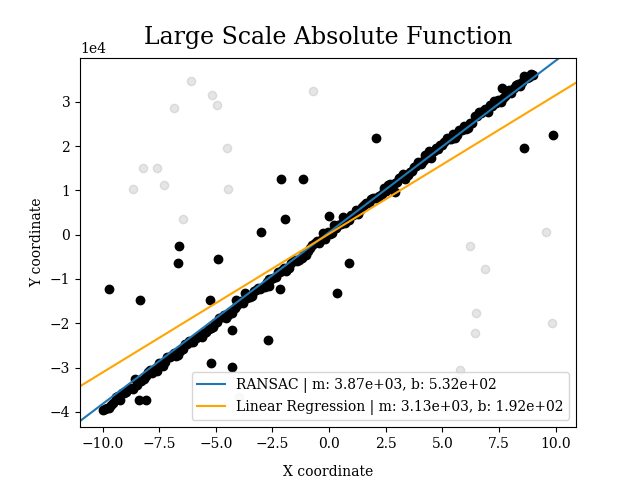

# RANSAC 
⭐ RANSAC is an algorithm used for fiting models with posible large amount of noise that can get wors performance due to this outlier points. In this project, its build a model in `C++` to fit noisy linear data.

---
Author -> Arnau Pérez Pérez | [Github](https://github.com/arnaupy) | [LinkedIn](https://www.linkedin.com/in/arnau-perez-perez/) | 01arnauperez@gmail.com


---

## Parameters and variables description
* `nData` | `nSamples` | `nInliers`: original, random samples and inliers size.
* `data`: original (x, y) coordinate pairs.
* `sampleData`: random (x, y) coordinate pairs taken from data.
* `currentInliers`: (x, y) coordinate pairs that are inferred as inliers.
* `bestInliers`: (x, y) coordinate pairs of inliers that have the greater  number of inliers.
* `maxIter`: number of times that a random sample is chosen.
* `maxIterLR`: number of times each random sample is trained.
* `currentModel`: m and b parameters at each iteration.
* `bestModel`: m and b parameters corresponding to model that infers the greater number of inliers.
* `lr (learning rate)`: a hyperparameter used to set the rate at which a model updates its parameters (m, b).
* `threshold`: criterion to decide whether a point is an inlier or not.
* `costFunction`: function used for accepting points as inliers.

## Algorithm steps to follow
1. Read the data into **nData** pairs of (x, y) coordinates.
2. Get a random set of points, **randomData**, of size **nSample** > 1.
3. Perform a LR(**maxIterLR** times) over **randomData** resulting in a **currentModel**.
4. Count **nInliers** using **currentModel** over data and store this points in **currentInliers**.
5. If currentModel has more **nInliers** than than **bestModel**, replace **bestModel** by **currentModel** parameters, otherwise continue to the next step.
6. Repeat steps 2 to 5 until **maxIter**.
7. At that point you have a **bestModel** with m and b parameters and **bestInliers** with (x, y) coordinates, where **nInliers** ≤ **nData**.
8. `(Optional)` Perform a LR(**maxIterLR** times) over **bestInliers** resulting in a **bestModel** (superbestModel if you'd like to call it).

## Model performance
The threshold values must align in the same data magnitude. To ensure this alignment, the `median absolute deviation (MAD)` is employed and calculated as follows [[3]](https://github.com/scikit-learn/scikit-learn/blob/84c3ff0fc122a5aa16b224ac081856808f42f2e5/sklearn/linear_model/_ransac.py#L72):
$$MAD(y)=median(y−median(y))$$

For empirical validation of the model's efficacy in generating noisy linear data, a concise program [dataBuilder.cpp](dataBuilder.cpp) has been developed and executed.

Two different cost functions are proposed to be used in Inliers counter process:
* `Absolute function` -> $|y_{pred} - y|$
* `Square error function` -> $(y_{pred} - y)^{2}$

<div align="center">

<div class="row">
  <div class="column">
    
    
  
  </div> 
  <div class="column">
    
    
  </div>
  <div class="column">
    
    
  </div>
</div>

`Figure 1.` Comparative analysis of distinct scale magnitudes delineated by the linear data slope values. **Gray** data points represent outliers, while **black** data points represent inliers as determined by the model. Additionally, the performance of both the RANSAC model and standard Linear Regression is shown.
</div>

<div align="center">

|   Scale   	|           Slope (m)         	| Intercept (b) 	| Observations |
|:----------:	|:---------------------------:	|:-------------:	|:------------:|
|  Small  |  0.002 | 5 | Due to the small differences between predicted and actual values, the `Squared Error` function make these distances even smaller.|
|  Medium  |  -4 | 12 | Both cost functions demonstrate effectiveness; however, in this particular example, the `Squared Error` function appears superior.| 
|  Large  |  4000 | 300 | Larger scale values amplify existing distances. If the data exhibits minimal deviation, the `Absolute Error` function may offer a more appropriate choice.|

`Table 1.` presents the data scale (magnitude) accompanied by arbitrarily generated linear data with parameters **m** and **b** along with added noise. Additionally, notable observations are documented, concluded from the accompanying figures.
</div>

## Next Steps
* `Enhance the research environment` by incorporating additional functionalities to facilitate algorithm testing.

* `Conduct an in-depth investigation` into cost functions to ensure model magnitude independence.

* `Conduct comprehensive testing` with diverse parameter sets to assess their impact on model performance.

* `Implement an estimation for maxIter` by introducing a confidence formula. [[4]](https://rmozone.com/snapshots/2015/07/cdg-room-refs/ransac.pdf)


## Short guide for using the code
There are three distinct executable files in the project:

* `Two C++` files for generating testing data [dataBuilder.cpp](dataBuilder.cpp) and running tests [main.cpp](main.cpp).
* `One Python` file for plotting results [plot.py](plot.py).

For [dataBuilder.cpp](dataBuilder.cpp):
```
g++ -o dataBuilder.exe dataBuilder.cpp
```

For [main.cpp](main.cpp):
```
g++ -std=c++11 -o main.exe main.cpp includes/logFunctionalities.cpp includes/utils.cpp includes/linearRANSAC.cpp includes/fileFunctionalities.cpp
```

After compiling, run the executables with the `-h` flag to view the instructions:
```
./dataBuilder.exe -h
```
```
./main.exe -h
```

For the Python file, there is also a help flag:
```
python plot.py -h
```

Data should be stored in the [Data](./Data/) directory and be in a txt file with the first column representing the x-coordinate, while the second column represents the y-coordinate.

Parameters should be stored in the [Parameters](./Parameters/) directory with the name `parameters_i.txt`, where i is a number between 0 and 9, used for naming the file. 

The structure of this file is:
```
$2 nSamples threshold lr costFunction
0 4 0. 0.01 0
1 4 0. 0.01 1
```

Parameters detail:
* The `$2` indicates the number of rows (sets of parameters) you want to test the model with.
* `threshold`: If it is 0, the model will estimate this value.
* `costFunction`: 
  * 0 -> absolute function
  * 1 -> square error function.


## References 
[1] Outlier detection using the RANSAC algorithm | https://medium.com/mlearning-aioutlier-detection-using-the-ransac-algorithm-de52670adb4a
  
[2] Dealing with Outliers: RANSAC | Image Stitching | https://www.youtube.com/watch?v=EkYXjmiolBg

[3] Python scikit learn library | MAD threshold | https://github.com/scikit-learn/scikit-learn/blob/84c3ff0fc122a5aa16b224ac081856808f42f2e5/sklearn/linear_model/_ransac.py#L72

[4] Overview of the RANSAC Algorithm, Konstantinos G. Derpanis | https://rmozone.com/snapshots/2015/07/cdg-room-refs/ransac.pdf


